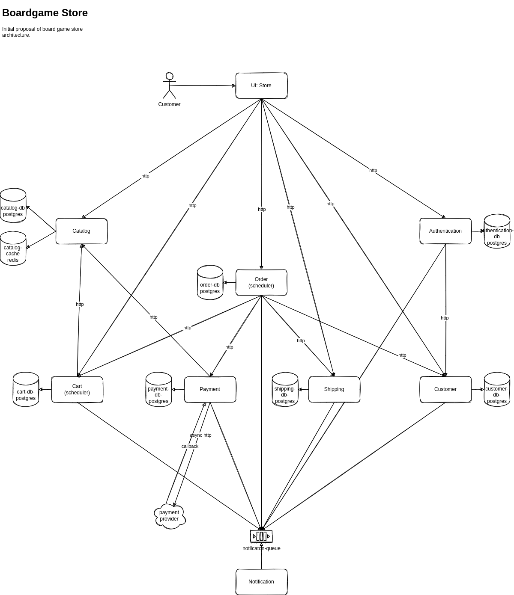

# Opentelemetry Java Reference Architecture

This repository contains an illustrative 'Boardgame Store' application, that was used to demonstrate Opentelemetry features, the current focus is in the java ecosystem.

> :warning: We do not pretend to replace the [opentelemetry community demo](https://github.com/open-telemetry/opentelemetry-demo), we just are focused on java ecosystem and in the technologies that we use. :)

 

## 📂 Repository Structure

This repository has the following structure:

- [applications](applications) - applications that compose the Boardgame Store.
- [commons](commons) - libraries that are used in multiple applications.
- [docs](docs) - technical documentation.

## :classical_building: Current Architecture

## 📚 References

- [Opentelemetry](https://opentelemetry.io/)
- [Opentelemetry - Community Demo](https://github.com/open-telemetry/opentelemetry-demo)
